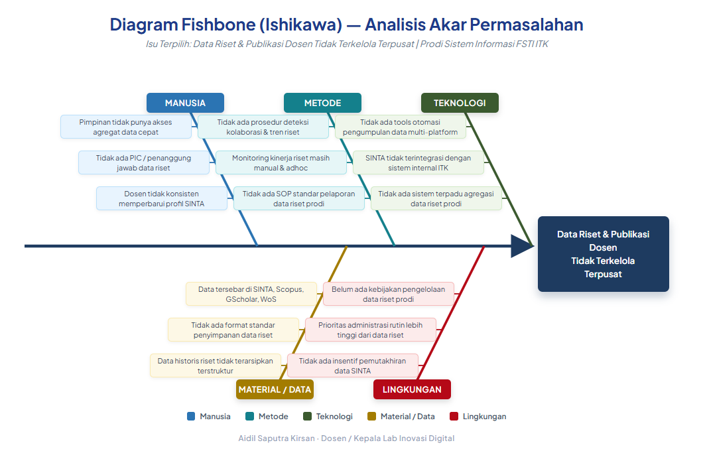
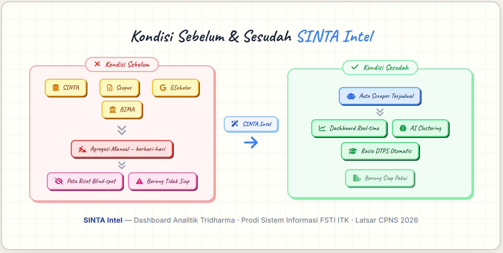

# Rancangan Aktualisasi
**Pelatihan Dasar CPNS Angkatan VI Tahun 2026**

Pengembangan Sistem Dashboard Analitik Tridharma Berbasis SINTA (SINTA Intel) 
pada Lab Inovasi Digital Prodi SI FSTI ITK

Disusun Oleh: <b class="text-blue-800 dark:text-blue-400">Aidil Saputra Kirsan, S.ST., M.Tr.Kom</b>

---
layout: center
---

# Outline Presentasi

  

    

      <i class="fas fa-user-shield text-xl"></i>
    

    

      
Agenda 1–3 · Nilai Dasar ASN

      
Bela Negara, BerAKHLAK, Smart Governance & Manajemen ASN

    

  

  

    

      <i class="fas fa-magnifying-glass-chart text-xl"></i>
    

    

      
Identifikasi & Analisis Isu

      
Metode USG, Fishbone, penetapan isu terpilih

    

  

  

    

      <i class="fas fa-microchip text-xl"></i>
    

    

      
Gagasan Kreatif · SINTA Intel

      
Tujuan, manfaat, kondisi before/after, 7 fitur utama

    

  

  

    

      <i class="fas fa-list-check text-xl"></i>
    

    

      
Rencana Aktualisasi

      
5 kegiatan, jadwal 7 minggu, output & deliverables

    

  

---
layout: two-cols
---

# Profil Instansi
**Institut Teknologi Kalimantan (ITK)**

Satu-satunya Institut Teknologi Negeri di wilayah Tengah dan Timur Indonesia, berlokasi di Balikpapan, Kalimantan Timur.

 

<v-clicks>

- **Dasar Hukum:** Perpres No. 125 Tahun 2014
- **Akreditasi:** B (BAN-PT)
- **Fokus Riset:** Energi, Smart City, Kemaritiman, Tek. Pangan
- **Rektor:** Prof. Dr. rer. nat. Agus Rubiyanto, M.Eng.Sc.

</v-clicks>

::right::

<b>Visi ITK:</b>

Menjadi perguruan tinggi unggul dan berperan aktif dalam pembangunan nasional melalui pemberdayaan potensi daerah Kalimantan.

<b>Misi:</b>

Menyelenggarakan Tridharma PT bermutu · Menghasilkan lulusan unggul · Membangun kerja sama dengan pemangku kepentingan.

---
layout: center
---

# Profil Peserta & Jabatan

  

    
<i class="fas fa-user-circle text-2xl"></i>

    
Aidil Saputra Kirsan, S.ST., M.Tr.Kom

    
NIP. 199403172025061004

    
Penata Muda Tk.I / III-b

  

  
  

    
<i class="fas fa-briefcase text-2xl"></i>

    
Dosen Asisten Ahli / Ka. Lab

    
Lab Inovasi Digital Prodi Sistem Informasi, FSTI ITK

  

  

    
Mentor

    
Irma Fitria, S.Si., M.Si

  

  

    
Coach

    
Mustari Kurniawati, S.IP., MPA

  

  

    
Habituasi

    
7 Maret – 22 April 2026 · 7 Minggu

  

---
layout: default
---

# Agenda 1 — Sikap Perilaku Bela Negara

Bela Negara bukan sekadar urusan militer, melainkan **tekad, sikap, dan perilaku warga negara** yang dijiwai kecintaan terhadap NKRI.

  

    
🇮🇩

    
Cinta Tanah Air

    
Kebanggaan mengabdi sebagai ASN Dosen di PTN yang memajukan pendidikan di Kalimantan

  

  

    
🤝

    
Sadar Berbangsa & Bernegara

    
Menghormati keberagaman dan berkontribusi aktif pada pembangunan nasional

  

  

    
⭐

    
Setia Kepada Pancasila

    
Menjadikan Pancasila sebagai landasan dalam setiap keputusan

  

  

    
🛡️

    
Rela Berkorban

    
Mendahulukan kepentingan institusi; membangun SINTA Intel melebihi tugas pokok

  

  

    
💪

    
Kemampuan Bela Negara

    
Menggunakan keahlian IT untuk transformasi layanan publik

  

---
layout: default
---

# Agenda 2 — Nilai Dasar ASN BerAKHLAK

Tujuh nilai inti ASN yang diimplementasikan dalam aktualisasi:

  

    
B

    
Berorientasi Pelayanan

    
SINTA Intel mempercepat akses data Tridharma bagi pimpinan

  

  

    
Akuntabel

    
Kalkulasi rasio DTPS otomatis & terverifikasi

  

  

    
Kompeten

    
Penggunaan Python, Vue.js & ML (TF-IDF/K-Means)

  

  

    
Harmonis

    
Mengakomodasi kebutuhan 2 prodi (SI & Bisnis Digital)

  

  

    
Loyal

    
Berkontribusi langsung pada nilai akreditasi BAN-PT institusi

  

  

    
Adaptif

    
Memanfaatkan AI/NLP dan data engineering untuk menyelesaikan masalah

  

  

    
Kolaboratif

    
Kerja sama dengan Kaprodi, Wakil Dekan, Tim Mutu FSTI

  

---
layout: default
---

# Agenda 3 — Smart Governance & Manajemen ASN

Isu terpilih sangat erat kaitannya dengan peran dan kedudukan PNS dalam mewujudkan **Smart Governance**:

  

    <h3 class="text-blue-800 dark:text-blue-400 font-bold border-b border-blue-200 dark:border-slate-600 pb-2 mb-3"><i class="fas fa-microchip mr-2"></i>Smart ASN</h3>
    
Penulis tidak sekadar menggunakan teknologi, melainkan <i>menciptakan</i> solusi digital inovatif berbasis ML dan data engineering — manifestasi nyata profil Smart ASN.

  

  
  

    <h3 class="text-green-800 dark:text-emerald-400 font-bold border-b border-green-200 dark:border-slate-600 pb-2 mb-3"><i class="fas fa-chart-bar mr-2"></i>Manajemen ASN</h3>
    
ASN Dosen wajib membuktikan kinerja Tridharma secara terukur. SINTA Intel mendukung implementasi Manajemen ASN yang akuntabel, transparan, dan berbasis data.

  

---
layout: default
---

# Identifikasi Isu

Berdasarkan analisis situasi di unit kerja, ditemukan **3 isu aktual**:

<v-clicks>

1. **Pengelolaan Tugas Akhir/Skripsi Mahasiswa FSTI ITK Belum Efektif**
   
Proses manual via berkas fisik; dokumen TA tidak terkelola dengan baik; admin kesulitan mengelola administrasi dan penjadwalan sidang.

2. Pengelolaan Data Riset & Pengabdian Dosen Belum Terpusat dan Teranalisis
   
Data tersebar di SINTA, Scopus, GScholar tanpa agregasi. Peta riset tidak terbaca; nilai akreditasi prodi terdampak langsung.

3. **Umpan Balik Mahasiswa terhadap Layanan Akademik Belum Digital**
   
Pengumpulan sporadis via kuesioner kertas yang tidak terintegrasi.

</v-clicks>

---
layout: statement
---

# Isu Terpilih

Pengelolaan Data Riset & Pengabdian Dosen di Lab Inovasi Digital Belum Terpusat dan Teranalisis

---
layout: center
---

# Analisis Isu — Metode USG

Penetapan isu menggunakan metode **Urgency, Seriousness, Growth (USG)**:

  <table class="w-full text-sm text-left">
    <thead class="bg-gradient-to-r from-blue-700 to-indigo-800 text-white font-bold">
      <tr>
        <th class="px-4 py-3 border-b border-indigo-500 text-center">Isu Aktual</th>
        <th class="px-2 py-3 border-b border-indigo-500 text-center">U</th>
        <th class="px-2 py-3 border-b border-indigo-500 text-center">S</th>
        <th class="px-2 py-3 border-b border-indigo-500 text-center">G</th>
        <th class="px-2 py-3 border-b border-indigo-500 text-center">Total</th>
        <th class="px-3 py-3 border-b border-indigo-500 text-center">Prioritas</th>
      </tr>
    </thead>
    <tbody class="bg-white dark:bg-slate-900 border-b dark:border-slate-700">
      <tr class="hover:bg-blue-50 dark:hover:bg-slate-800 transition-colors border-b dark:border-slate-700 dark:text-gray-200">
        <td class="px-4 py-3">Pengelolaan TA/Skripsi Mahasiswa</td>
        <td class="px-2 py-3 text-center">4</td>
        <td class="px-2 py-3 text-center">4</td>
        <td class="px-2 py-3 text-center">3</td>
        <td class="px-2 py-3 text-center font-bold">11</td>
        <td class="px-3 py-3 text-center">II</td>
      </tr>
      <tr class="bg-blue-100/50 dark:bg-blue-900/30 border-b dark:border-slate-700 font-semibold dark:text-gray-100">
        <td class="px-4 py-3 text-blue-900 dark:text-blue-300 border-l-4 border-blue-600">Data Riset & Pengabdian Dosen Tidak Terpusat</td>
        <td class="px-2 py-3 text-center text-blue-800 dark:text-blue-400">5</td>
        <td class="px-2 py-3 text-center text-blue-800 dark:text-blue-400">5</td>
        <td class="px-2 py-3 text-center text-blue-800 dark:text-blue-400">4</td>
        <td class="px-2 py-3 text-center text-blue-900 dark:text-blue-300 font-bold text-base">14</td>
        <td class="px-3 py-3 align-middle">
I
</td>
      </tr>
      <tr class="hover:bg-blue-50 dark:hover:bg-slate-800 transition-colors dark:text-gray-200">
        <td class="px-4 py-3">Umpan Balik Kepuasan Layanan Digital</td>
        <td class="px-2 py-3 text-center">3</td>
        <td class="px-2 py-3 text-center">3</td>
        <td class="px-2 py-3 text-center">3</td>
        <td class="px-2 py-3 text-center font-bold">9</td>
        <td class="px-3 py-3 text-center">III</td>
      </tr>
    </tbody>
  </table>

<b>Alasan Isu #2 Terpilih:</b> U=5 (jadwal akreditasi semakin dekat) · S=5 (memengaruhi nilai akreditasi langsung) · G=4 (volume publikasi terus bertambah tanpa sistem pengelolaan)

---
layout: default
transition: slide-up
---

# Analisis Akar Masalah — Fishbone

  

---
layout: default
---

# Tujuan Aktualisasi

  

    
1

    
Mengimplementasikan pemahaman profil <b>Smart ASN</b> dan <b>Manajemen ASN</b>, serta mendemonstrasikan nilai-nilai dasar <b>BerAKHLAK</b> secara nyata.

  

  

    
2

    
Menganalisis akar masalah belum terpusatnya agregasi data riset dosen FSTI ITK menggunakan pisau analisis isu, serta merumuskan gagasan kreatif yang komprehensif.

  

  

    
3

    
Membangun prototipe sistem dashboard analitik <b>SINTA Intel</b> dari tahap akuisisi data hingga visualisasi analitik sebagai landasan awal ekosistem di FSTI ITK.

  

---
layout: default
---

# Manfaat & Ruang Lingkup

  

    <h3 class="font-bold text-blue-700 dark:text-blue-400 mb-2 text-sm"><i class="fas fa-user-tie mr-1"></i> ASN Dosen</h3>
    
Mengembangkan kompetensi teknis (Python, ML, Vue.js) & mengaktualisasikan BerAKHLAK secara nyata sebagai Smart ASN

  

  

    <h3 class="font-bold text-amber-700 dark:text-amber-400 mb-2 text-sm"><i class="fas fa-building-columns mr-1"></i> Unit Kerja</h3>
    
Tersedia sistem terpusat; keputusan pimpinan berbasis data akurat; persiapan akreditasi program studi lebih mudah

  

  

    <h3 class="font-bold text-green-700 dark:text-emerald-400 mb-2 text-sm"><i class="fas fa-landmark mr-1"></i> Institusi (ITK)</h3>
    
Akuntabilitas kinerja terbukti; potensi model <i>best practice</i> yang dapat direplikasi ke prodi lain

  

  

    <h3 class="font-bold text-red-700 dark:text-red-400 mb-2 text-sm"><i class="fas fa-earth-asia mr-1"></i> Ekosistem</h3>
    
Terdeteksi peluang kolaborasi riset lintas prodi; terbentuk peta riset ITK; produktivitas meningkat kolektif

  

  <b class="text-purple-700 dark:text-purple-400"><i class="fas fa-expand-arrows-alt mr-1"></i> Batasan:</b>
  1. Dosen aktif Prodi SI & Bisdig; belum mencakup prodi lain 2. Sumber data terbatas API SINTA terbuka & BIMA 3. Evaluasi internal; belum mencakup pengujian keamanan eksternal

---
layout: default
---

# Kondisi Sebelum & Sesudah SINTA Intel

  

---
layout: default
---

# 7 Fitur Utama SINTA Intel

  

    
<i class="fas fa-chart-line"></i>

    
F1 · Dashboard SINTA

    
Visualisasi metrik Tridharma: publikasi, penelitian, pengabdian, HKI, H-Index per dosen

  

  

    
<i class="fas fa-folder-open"></i>

    
F2 · Research Gallery

    
Galeri 6 kategori karya: publikasi, penelitian, pengabdian, buku, HKI, lainnya

  

  

    
<i class="fas fa-robot"></i>

    
F3 · AI Clustering

    
ML: TF-IDF + K-Means untuk deteksi topik & potensi kolaborasi riset lintas prodi

  

  

    
<i class="fas fa-arrow-trend-up"></i>

    
F4 · Sankey Timeline

    
Evolusi topik riset 2018–sekarang dalam alur visual interaktif

  

  

    
<i class="fas fa-sack-dollar"></i>

    
F5 · Funding Dashboard

    
Monitoring aliran dana riset & hibah per dosen; sumber pendanaan internal dan BIMA

  

  

    
<i class="fas fa-graduation-cap"></i>

    
F6 · DTPS Akreditasi

    
Kalkulasi otomatis Rasio Penelitian/DTPS, Pengabdian/DTPS, Dana/DTPS sesuai LKPS standard borang

  

  

    
<i class="fas fa-magnifying-glass"></i>

    
F7 · Expertise Finder

    
Matchmaking pakar berbasis TF-IDF Scoring untuk mitra riset & pengabdian

  

---
layout: default
---

# 5 Kegiatan Aktualisasi

Setiap kegiatan dilandasi nilai **BerAKHLAK** dan keterkaitan **Smart ASN & Manajemen ASN**:

 

<v-clicks>

1. **Pemetaan & Pengumpulan Data Dosen** *(Minggu 1–2)*
   
Inventarisasi data dosen SI & Bisdig dari SINTA · Koordinasi dengan Kaprodi & Wakil Dekan Akademik

2. **Pengembangan Pipeline Scraper Otomatis** *(Minggu 2–3)*
   
Membangun scraper Python yang mengambil data dari SINTA API secara otomatis & terjadwal

3. **Implementasi Fitur Analytics & Dashboard AI** *(Minggu 3–5)*
   
AI Clustering (TF-IDF + K-Means), Sankey Timeline, Research Gallery, Expertise Finder

4. **Implementasi Dashboard Akreditasi & Funding** *(Minggu 4–6)*
   
Fitur DTPS Akreditasi (standar borang prodi) dan Funding Dashboard (monitoring hibah BIMA)

5. **Deployment, Sosialisasi & Evaluasi Sistem** *(Minggu 6–7)*
   
Deploy ke server ITK · Pelatihan pengguna · Evaluasi & dokumentasi

</v-clicks>

---
layout: default
---

# Kegiatan 1–2: Data & Pipeline

  

    <h3 class="font-bold text-blue-700 dark:text-blue-400 text-sm mb-3"><i class="fas fa-database mr-2"></i>Kegiatan 1: Pemetaan Data</h3>
    

      
<b>Tahapan:</b>

      <ul class="list-disc ml-4 space-y-1">
        <li>Inventarisasi data dosen dari SINTA per prodi</li>
        <li>Koordinasi kebutuhan data dengan pimpinan</li>
        <li>Validasi kelengkapan profil dosen</li>
      </ul>
      

        <b>Output:</b> Dokumen inventarisasi data dosen (2 prodi)
      

    

  

  
  

    <h3 class="font-bold text-indigo-700 dark:text-indigo-400 text-sm mb-3"><i class="fas fa-code mr-2"></i>Kegiatan 2: Pipeline Scraper</h3>
    

      
<b>Tahapan:</b>

      <ul class="list-disc ml-4 space-y-1">
        <li>Develop scraper Python (SINTA API)</li>
        <li>Automasi pipeline data berkala</li>
        <li>Data cleaning & normalisasi</li>
      </ul>
      

        <b>Output:</b> Pipeline scraper otomatis & dataset dosen terstruktur
      

    

  

---
layout: default
---

# Kegiatan 3: Analytics & Dashboard AI

Inti dari SINTA Intel — implementasi 4 fitur utama berbasis Machine Learning:

  

    
<i class="fas fa-robot mr-1"></i> AI Clustering

    
TF-IDF + K-Means mendeteksi cluster topik riset & potensi kolaborasi lintas prodi secara otomatis

  

  

    
<i class="fas fa-arrow-trend-up mr-1"></i> Sankey Timeline

    
Visualisasi evolusi topik riset & pengabdian 2018–sekarang dalam alur interaktif

  

  

    
<i class="fas fa-folder-open mr-1"></i> Research Gallery

    
Galeri 6 kategori karya akademik: publikasi, penelitian, pengabdian, buku, HKI, lainnya

  

  

    
<i class="fas fa-magnifying-glass mr-1"></i> Expertise Finder

    
Matchmaking pakar berbasis TF-IDF Scoring untuk pelacakan mitra riset & pengabdian

  

  <b class="text-blue-700 dark:text-blue-400">Output:</b> Dashboard analitik berfungsi penuh dengan 4 fitur AI/ML terintegrasi

---
layout: default
---

# Kegiatan 4–5: Akreditasi & Deployment

  

    <h3 class="font-bold text-green-700 dark:text-emerald-400 text-sm mb-3"><i class="fas fa-graduation-cap mr-2"></i>Kegiatan 4: Akreditasi & Funding</h3>
    

      <ul class="list-disc ml-4 space-y-1">
        <li>DTPS Akreditasi: Rasio Penelitian/DTPS, Pengabdian/DTPS, Dana/DTPS otomatis</li>
        <li>Funding Dashboard: aliran hibah BIMA per dosen</li>
        <li>Dashboard SINTA utama + visualisasi metrik</li>
      </ul>
      

        <b>Output:</b> Fitur akreditasi & funding dashboard siap pakai
      

    

  

  
  

    <h3 class="font-bold text-amber-700 dark:text-amber-400 text-sm mb-3"><i class="fas fa-rocket mr-2"></i>Kegiatan 5: Deploy & Sosialisasi</h3>
    

      <ul class="list-disc ml-4 space-y-1">
        <li>Deployment ke server ITK</li>
        <li>Pelatihan pengguna (dosen & pimpinan)</li>
        <li>Evaluasi penggunaan & pengumpulan feedback</li>
        <li>Dokumentasi teknis & Manual pengguna</li>
      </ul>
      

        <b>Output:</b> Sistem live · Manual pengguna · Laporan evaluasi
      

    

  

---
layout: image
image: ./matriksberakhlak-kegiatan.png
backgroundSize: contain
class: 'bg-white'
---

---
layout: default
---

# Jadwal Pelaksanaan (7 Minggu)

Pelaksanaan aktualisasi: **7 Maret – 22 April 2026** (Habituasi Off Campus)

  
  <table class="w-full text-xs text-left">
    <thead>
      <tr class="bg-gradient-to-r from-blue-700 to-indigo-800 text-white font-bold text-center">
        <th rowspan="2" class="px-2 py-2 w-8 border border-white/20">No</th>
        <th rowspan="2" class="px-3 py-2 border border-white/20">Kegiatan</th>
        <th colspan="3" class="px-2 py-2 border border-white/20 bg-blue-800/50">Maret 2026</th>
        <th colspan="4" class="px-2 py-2 border border-white/20 bg-teal-700/50">April 2026</th>
      </tr>
      <tr class="bg-slate-800 text-white text-[10px] text-center border-b border-white/20">
        <th class="py-1 w-[8%] border border-white/20">M1 07-13</th>
        <th class="py-1 w-[8%] border border-white/20">M2 14-20</th>
        <th class="py-1 w-[8%] border border-white/20">M3 21-27</th>
        <th class="py-1 w-[8%] border border-white/20">M4 28-03</th>
        <th class="py-1 w-[8%] border border-white/20">M5 04-10</th>
        <th class="py-1 w-[8%] border border-white/20">M6 11-17</th>
        <th class="py-1 w-[8%] border border-white/20">M7 18-22</th>
      </tr>
    </thead>
    <tbody class="bg-gray-50 dark:bg-slate-900 text-center text-gray-800 dark:text-gray-200">
<tr class="border-b border-gray-200 dark:border-slate-700">
<td class="py-2 border-r border-gray-200">1</td>
<td class="px-3 py-2 text-left border-r border-gray-200">Pemetaan & Pengumpulan Data</td>
<td class="bg-blue-500 border border-white">

</td>
<td class="bg-blue-500 border border-white">

</td>
<td class="border-r border-gray-200"></td>
<td></td><td></td><td></td><td></td>
</tr>
<tr class="border-b border-gray-200 dark:border-slate-700">
<td class="py-2 border-r border-gray-200">2</td>
<td class="px-3 py-2 text-left border-r border-gray-200">Pipeline Scraper SINTA</td>
<td class="border-r border-gray-200"></td>
<td class="bg-blue-600 border border-white">

</td>
<td class="bg-blue-600 border border-white">

</td>
<td></td><td></td><td></td><td></td>
</tr>
<tr class="border-b border-gray-200 dark:border-slate-700">
<td class="py-2 border-r border-gray-200">3</td>
<td class="px-3 py-2 text-left border-r border-gray-200">Analytics & Dashboard AI</td>
<td class="border-r border-gray-200"></td>
<td class="border-r border-gray-200"></td>
<td class="bg-blue-700 border border-white">

</td>
<td class="bg-blue-700 border border-white">

</td>
<td class="bg-blue-700 border border-white">

</td>
<td></td><td></td>
</tr>
<tr class="border-b border-gray-200 dark:border-slate-700">
<td class="py-2 border-r border-gray-200">4</td>
<td class="px-3 py-2 text-left border-r border-gray-200">Dashboard Akreditasi & Funding</td>
<td class="border-r border-gray-200"></td>
<td class="border-r border-gray-200"></td>
<td class="border-r border-gray-200"></td>
<td class="bg-indigo-600 border border-white">

</td>
<td class="bg-indigo-600 border border-white">

</td>
<td class="bg-indigo-600 border border-white">

</td>
<td></td>
</tr>
<tr class="">
<td class="py-2 border-r border-gray-200">5</td>
<td class="px-3 py-2 text-left border-r border-gray-200">Deploy, Sosialisasi & Evaluasi</td>
<td class="border-r border-gray-200"></td>
<td class="border-r border-gray-200"></td>
<td class="border-r border-gray-200"></td>
<td class="border-r border-gray-200"></td>
<td class="border-r border-gray-200"></td>
<td class="bg-indigo-700 border border-white">

</td>
<td class="bg-indigo-700 border border-white">

</td>
</tr>
    </tbody>
  </table>
  
  

    

 = Minggu aktif kegiatan berlangsung

    
<i>*M1–M3 = Maret 2026 | M4–M7 = April 2026</i>

  

---
layout: default
---

# Rencana Output & Deliverables

  

    
<i class="fas fa-globe text-lg"></i>

    

      
Sistem SINTA Intel

      
Dashboard web analitik live di server ITK dengan 7 fitur utama terintegrasi

    

  

  

    
<i class="fas fa-database text-lg"></i>

    

      
Pipeline Scraper Otomatis

      
Script Python yang mengambil data SINTA secara terjadwal & otomatis

    

  

  

    
<i class="fas fa-file-alt text-lg"></i>

    

      
Dokumentasi & Manual Pengguna

      
Buku panduan operasional (user guide) dan dokumentasi teknis pengelolaan data riset

    

  

  

    
<i class="fas fa-chart-pie text-lg"></i>

    

      
Laporan Evaluasi

      
Hasil evaluasi penggunaan, feedback pengguna, dan rekomendasi pengembangan

    

  

  <b>"Transformasi Digital untuk Akuntabilitas Tridharma Perguruan Tinggi"</b>

---
layout: center
class: text-center
---

# Terima Kasih
**Mohon Arahan dan Masukannya**

  
Aidil Saputra Kirsan, S.ST., M.Tr.Kom

  
Dosen Asisten Ahli / Kepala Lab Inovasi Digital

  
Prodi Sistem Informasi · FSTI · Institut Teknologi Kalimantan

